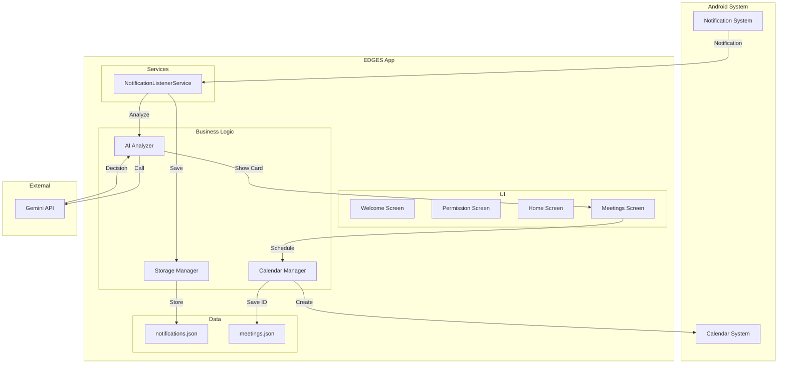

# EDGES Notification Assistant - Design Document

## Overview

EDGES is a native Android application (API 26+) that functions as an intelligent notification assistant powered by Google Gemini AI. The app monitors incoming notifications, detects meeting requests, and lets users schedule them in their calendar with one tap. The architecture emphasizes simplicity with on-device JSON storage, direct API calls, and a clean MVVM pattern with Jetpack Compose UI.

### Core Concept: AI as Decision Maker

The AI analyzes notifications and provides transparent decisions:
- Analyzes notification content and context
- Detects meeting requests with confidence scoring
- Provides complete meeting details ready for scheduling
- Shows meeting cards with AI reasoning visible to users
- Users see why AI made each decision (bullet points)
- Users can click "Schedule" or "Dismiss" on each suggestion

### Key Design Principles

1. **Simplicity First**: JSON file storage, direct API calls, minimal complexity
2. **User-Friendly**: Clear UI showing AI decisions and reasoning
3. **Reliable Background Service**: Continuous notification monitoring
4. **Modern UX**: Beautiful Jetpack Compose UI with intuitive flows
5. **Transparent AI**: Users see why AI made each decision

### Technology Stack

**Platform**: Android API 26+ (Android 8.0 Oreo and above)

**Language**: Kotlin

**UI Framework**: Jetpack Compose (modern declarative UI)

**Architecture**: MVVM (Model-View-ViewModel)

**Key Libraries**:
- Retrofit: HTTP client for Gemini API calls
- Kotlinx Serialization: JSON parsing and serialization
- Coroutines: Asynchronous programming
- Jetpack Compose: UI components and navigation

**APIs**:
- Google Gemini API (gemini-2.0-flash-exp): AI analysis
- Android CalendarContract: Native calendar integration

**Storage**: JSON files in app private directory (no database)

**No Backend**: All API calls made directly from device

## Architecture

### High-Level Architecture

### MVVM Architecture Pattern

**Model Layer**:
- Data classes (Notification, Meeting, AIResponse)
- Storage manager (JSON file operations)
- API clients (Gemini API, Calendar API)

**ViewModel Layer**:
- HomeViewModel (dashboard state, statistics)
- MeetingsViewModel (suggestions list, scheduling actions)
- Handles business logic and state management
- Exposes StateFlow to UI

**View Layer**:
- Jetpack Compose screens and components
- Observes ViewModel state
- Handles user interactions

### Simple Flow

**Notification Processing**:
1. Notification arrives → NotificationListenerService captures it
2. Save to notifications.json
3. Send to AI Analyzer
4. AI returns decision + meeting details + reasoning (bullet points)
5. Show meeting card with AI reasoning visible
6. User clicks "Schedule" or "Dismiss"
7. Create calendar event
8. Done!

