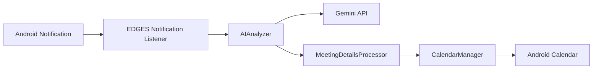

# EDGES Notification Assistant

An Android application that monitors incoming notifications, identifies likely meeting requests with Gemini-based AI analysis, and helps users schedule events in their calendar.

## Overview

EDGES is designed for the common workflow where notifications contain meeting invites, scheduling details, or follow-up requests. The app monitors notifications, analyzes text content, and decides whether to schedule, ask for confirmation, or dismiss the item.

## What is implemented

- Android app entry point and permission flow
- Notification listener setup for monitoring incoming notifications
- AI analysis flow using Google Gemini
- Meeting detection with confidence scoring
- Calendar scheduling support
- MVVM-oriented project structure with model/data/service separation

## What is still planned or incomplete

- Production-grade configuration management for API keys
- Full user testing across varied notification types
- More robust handling for ambiguous meeting requests
- UI refinements for end-to-end workflow validation
- Additional privacy controls and notification filtering

## Architecture



## Technology Stack

- Language: Kotlin
- UI: Jetpack Compose
- Architecture: MVVM
- Minimum SDK: API 26
- Target SDK: API 34
- Networking: Retrofit + OkHttp
- Serialization: Kotlin Serialization / Gson
- Background work: WorkManager
- AI: Google Gemini API
- Calendar integration: Android CalendarContract

## Project Structure

```text
edges/
├── app/
│   ├── src/main/
│   │   ├── AndroidManifest.xml
│   │   ├── java/com/edges/notificationassistant/
│   │   │   ├── MainActivity.kt
│   │   │   ├── data/
│   │   │   ├── services/
│   │   │   ├── ui/
│   │   │   └── utils/
│   │   └── res/
│   └── build.gradle.kts
├── build.gradle.kts
├── settings.gradle.kts
├── gradlew
├── gradlew.bat
├── README.md
├── .gitignore
└── gradle/
```

## Permissions

The app requires Android permissions for the workflow to operate properly:

- `INTERNET`
- `READ_CALENDAR`
- `WRITE_CALENDAR`
- `BIND_NOTIFICATION_LISTENER_SERVICE`
- `POST_NOTIFICATIONS` (Android 13+)
- `WAKE_LOCK`
- `FOREGROUND_SERVICE`
- `RECEIVE_BOOT_COMPLETED`

## Setup

1. Open the project in Android Studio.
2. Sync Gradle files.
3. Configure a valid Gemini API key in your local Android build configuration.
4. Run the app on a supported Android device or emulator.

## How it works

1. The app listens to notifications.
2. Relevant notification content is sent to Gemini for analysis.
3. The response is parsed into a structured meeting decision.
4. If a meeting is detected with enough confidence, the app can schedule or prepare a calendar event.
5. Ambiguous notifications remain pending for user review.

## Installation notes

The app uses a direct Gemini API call from the Android client. This means the project must be configured with a valid key before it can make live AI requests.

Do not commit real API keys to version control.

## Usage

- Launch the app.
- Grant calendar permissions.
- Enable notification access.
- Let the app monitor incoming notifications.
- Review the detected meeting suggestions and scheduling decisions.

## Example workflow

```text
Notification arrives
    -> App inspects notification text
    -> Gemini decides whether it looks like a meeting request
    -> If confidence is high, prompt to schedule the event
    -> Calendar is updated with the meeting details
```

## Current limitations

- API key handling must be externalized before production use.
- Notification parsing is not yet robust for every possible message format.
- The app is mainly designed around meeting detection rather than general-purpose AI classification.
- Some behaviors depend on Android permission flows and user settings.

## Future improvements

- Secure configuration management for API keys
- Better handling for edge-case notifications
- More explicit user review and confirmation flow
- Advanced filtering for spam, marketing, or non-meeting traffic
- Better testing coverage for notification parsing and meeting extraction

## Security note

This project should not store real API keys in source code or public repositories. Use a local configuration approach or secure build-time injection instead.

## License

This project is not currently documented with a formal repository-level license file. Confirm licensing before redistribution or commercial use.

## Summary

EDGES demonstrates Android application development, AI integration, background monitoring, and calendar automation. It is a useful portfolio project once the configuration and documentation are cleaned up and the repo is free of exposed credentials.

---

This README is intentionally focused on what is actually present in the project and what is still in progress.
